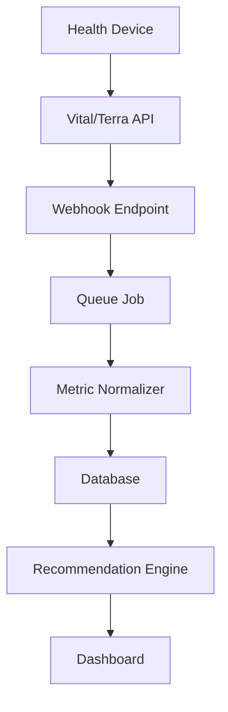
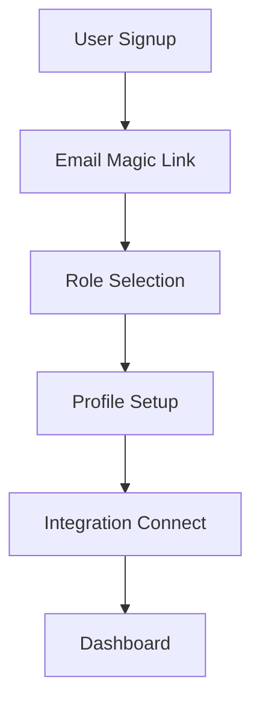
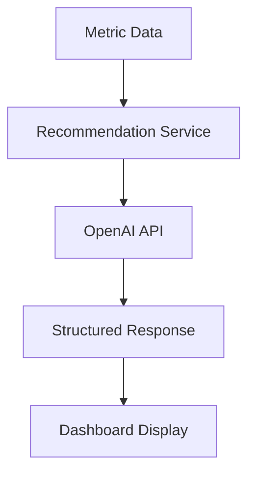

# 🏗️ Fitness App Architecture

## Overview

A production-ready Next.js fitness application with real health integrations, AI-powered recommendations, and subscription management. Built with TDD principles and clean architecture patterns.

## Tech Stack

- **Framework**: Next.js 15 (App Router, Server Actions)
- **UI**: shadcn/ui + Radix, Tailwind (grayscale only)
- **Database**: PostgreSQL with Prisma ORM
- **Auth**: NextAuth (email magic link + OAuth)
- **Payments**: Stripe subscriptions
- **Integrations**: Vital/Terra (aggregators), Polar AccessLink, Google Fit
- **AI**: OpenAI for recommendations and questionnaire normalization
- **Testing**: Vitest + Testing Library + Playwright
- **CI/CD**: GitHub Actions

## Architecture Patterns

### Clean Architecture Layers

```
src/
├── app/                    # Next.js App Router pages & API routes
├── components/            # React components (UI layer)
├── core/                  # Business logic (domain layer)
│   ├── domain/           # Entities, value objects, business rules
│   ├── services/         # Application services
│   └── ports/            # Interfaces for external dependencies
├── integrations/         # External service adapters
└── lib/                  # Shared utilities
```

### Domain-Driven Design

- **Entities**: User, Profile, Metric, Workout, Integration
- **Value Objects**: MetricType, WorkoutType, RecommendationType
- **Services**: RecommendationService, MetricNormalizationService
- **Repositories**: Abstract data access patterns

## Data Flow

### Health Data Ingestion



### User Authentication Flow



### AI Recommendation Flow



## Security & Privacy

- **Data Encryption**: Sensitive tokens encrypted at rest
- **GDPR Compliance**: Data export/deletion capabilities
- **Role-based Access**: User/Trainer role separation
- **Webhook Verification**: Signature validation for all integrations
- **Rate Limiting**: API endpoint protection

## Integration Strategy

- **Primary**: Vital/Terra as health data aggregators
- **Direct**: Polar AccessLink, Google Fit for specific use cases
- **Fallback**: Manual data entry with validation
- **Webhook Processing**: Background jobs for real-time data sync

## Testing Strategy

- **Unit Tests**: Domain logic, services, utilities (80% coverage)
- **Integration Tests**: API endpoints, database operations
- **E2E Tests**: Critical user flows with Playwright
- **TDD Approach**: Test-first development for all features

## Deployment & Monitoring

- **CI/CD**: GitHub Actions with branch protection
- **Health Checks**: `/api/health` endpoint
- **Logging**: Structured logging with pino
- **Error Tracking**: Sentry integration (optional)
- **Metrics**: Prometheus-ready request metrics
