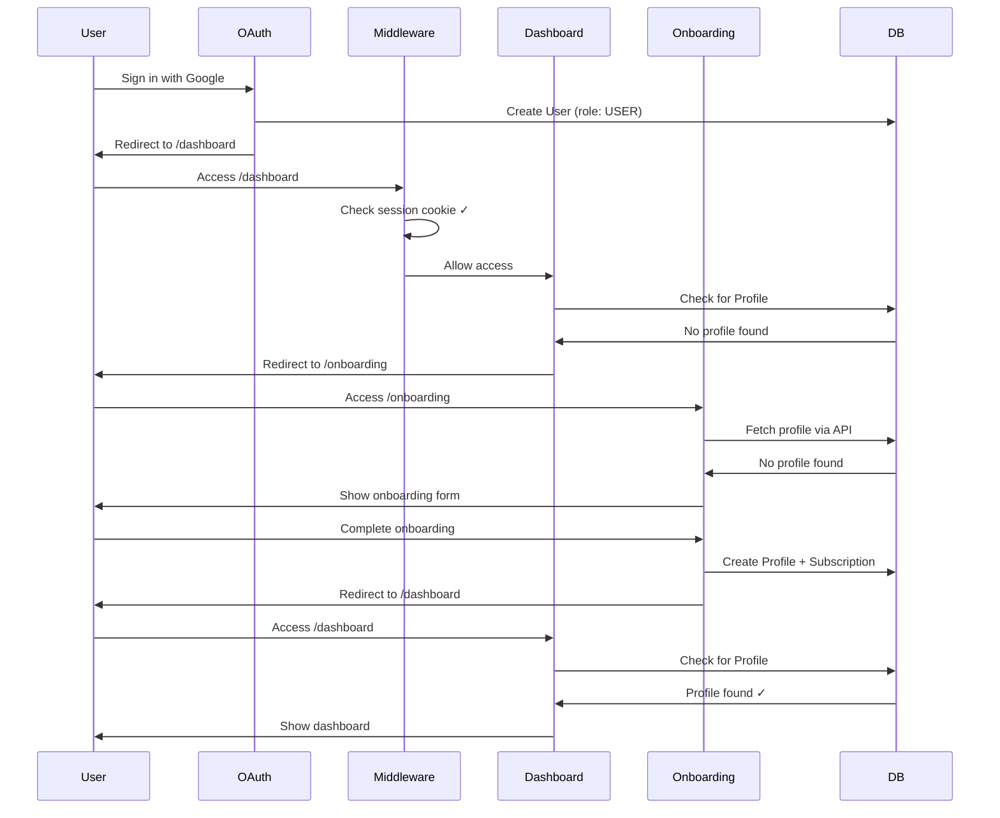
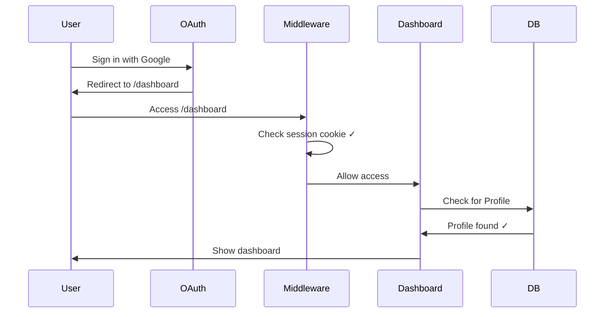

# Authentication Flow Fix

## Problem

After implementing Google OAuth, users were experiencing a redirect loop:

1. User signs in via Google OAuth successfully
2. User is redirected to `/onboarding`
3. `/onboarding` redirects back to `/auth/signin?callbackUrl=%2Fdashboard`
4. User is redirected to `/dashboard`
5. `/dashboard` redirects to `/auth/signin?callbackUrl=%2Fdashboard`
6. Loop continues indefinitely

## Root Cause Analysis

### Initial Issue (Commit: b7c5062)

The middleware was checking for `token.role` to determine if a user had completed onboarding. However, with **database sessions**, `getToken()` doesn't include custom fields like `role` from the database - it only includes the basic JWT payload.

**Fix Applied:**

- Modified middleware to only check for session cookie presence (authentication)
- Removed role checking from middleware
- Added client-side role check in onboarding page using `useSession()`

### Secondary Issue (Commit: e89302f)

After the middleware fix, users were still being redirected from `/dashboard` to `/auth/signin`. The issue was:

1. **Users get a default role**: In `prisma/schema.prisma`, the `User` model has `role Role @default(USER)`, meaning all new users automatically get the `USER` role
2. **Onboarding check was wrong**: The onboarding page was checking `session?.user?.role`, which would always be true since users have a default role
3. **Dashboard wasn't checking onboarding completion**: The dashboard layout was calling `requireAuth()` which only checks if a user is authenticated, not if they've completed onboarding

**The key insight:** Having a role doesn't mean a user has completed onboarding. We need to check if they have a `Profile` record instead.

## Solution

### 1. Dashboard Layout (`src/app/dashboard/layout.tsx`)

```typescript
export default async function DashboardLayout({ children }: { children: React.ReactNode }) {
  const user = await requireAuth();

  // Check if user has completed onboarding by checking for profile
  const profile = await db.profile.findUnique({
    where: { userId: user.id },
  });

  // Redirect to onboarding if user hasn't completed setup
  if (!profile) {
    redirect('/onboarding');
  }

  return (
    <div className="min-h-screen bg-background">
      <DashboardNav user={user} />
      <main className="container mx-auto px-4 py-8">{children}</main>
    </div>
  );
}
```

**Why this works:**

- Checks for `Profile` record instead of role
- Profile is only created during onboarding flow
- If no profile exists, user is redirected to `/onboarding`
- If profile exists, user can access dashboard

### 2. Onboarding Page (`src/app/onboarding/page.tsx`)

```typescript
export default function OnboardingPage() {
  const router = useRouter();
  const { data: session, status } = useSession();
  const [hasProfile, setHasProfile] = useState<boolean | null>(null);

  // Check if user has completed onboarding
  useEffect(() => {
    if (status === 'authenticated') {
      fetch('/api/profile')
        .then((res) => res.json())
        .then((data) => {
          if (data.profile) {
            // User has already completed onboarding
            router.push('/dashboard');
          } else {
            setHasProfile(false);
          }
        })
        .catch(() => {
          setHasProfile(false);
        });
    }
  }, [status, router]);

  // Show loading while checking profile status
  if (status === 'loading' || hasProfile === null) {
    return (
      <div className="flex min-h-screen items-center justify-center bg-background">
        <div className="text-center">
          <div className="text-lg">Loading...</div>
        </div>
      </div>
    );
  }

  // ... rest of onboarding flow
}
```

**Why this works:**

- Fetches profile from API to check completion status
- If profile exists, redirects to dashboard (user already completed onboarding)
- If no profile, shows onboarding flow
- Prevents users who completed onboarding from seeing the onboarding page again

### 3. Profile API (`src/app/api/profile/route.ts`)

Added `GET` method to retrieve user profile:

```typescript
export async function GET() {
  try {
    const session = await getServerSession(authOptions);

    if (!session?.user?.id) {
      return NextResponse.json({ error: 'Unauthorized' }, { status: 401 });
    }

    const profile = await db.profile.findUnique({
      where: { userId: session.user.id },
    });

    return NextResponse.json({ profile });
  } catch (error) {
    console.error('Profile fetch error:', error);
    return NextResponse.json({ error: 'Failed to fetch profile' }, { status: 500 });
  }
}
```

**Why this was needed:**

- Onboarding page needs to check if profile exists
- Previous implementation only had `PUT` method for updates
- Now supports both fetching and updating profiles

## Authentication Flow (After Fix)

### New User Sign-Up via OAuth



### Returning User Sign-In



## Key Learnings

1. **Database Sessions vs JWT Sessions**: With database sessions, custom fields like `role` are not available in the JWT token. They must be fetched from the database in callbacks or server components.

2. **Default Values Matter**: When a field has a default value (like `role Role @default(USER)`), checking for its presence won't work to determine if a user has completed a multi-step process.

3. **Onboarding Completion Indicator**: Use a separate indicator for onboarding completion. In this case, the presence of a `Profile` record indicates the user has completed onboarding.

4. **Middleware Limitations**: Middleware runs on the edge and has limited access to the database. Complex checks (like fetching related records) should be done in server components or API routes.

5. **Client-Side Checks**: For pages that need to check onboarding status, use client-side API calls with proper loading states to avoid flash of incorrect content.

## Testing Checklist

- [x] New user signs in via Google OAuth
- [x] User is redirected to onboarding
- [x] User completes onboarding
- [x] User is redirected to dashboard
- [x] User can access dashboard without redirect loop
- [x] Returning user signs in and goes directly to dashboard
- [x] User cannot access dashboard without completing onboarding
- [x] User cannot see onboarding page after completing it

## Related Files

- `src/middleware.ts` - Authentication middleware
- `src/app/dashboard/layout.tsx` - Dashboard layout with profile check
- `src/app/onboarding/page.tsx` - Onboarding page with completion check
- `src/app/api/profile/route.ts` - Profile API with GET method
- `src/lib/auth.ts` - NextAuth configuration
- `src/lib/session.ts` - Session helper functions
- `prisma/schema.prisma` - Database schema with User model

## Environment Variables

No new environment variables were added for this fix.

## Database Changes

No database migrations were required. The fix uses existing schema.

## Deployment Notes

1. Ensure `NEXTAUTH_URL` is set correctly in production
2. Ensure `NEXTAUTH_SECRET` is set in production
3. Google OAuth credentials must be configured
4. Database connection must be available
5. No additional setup required - changes are backward compatible

## Monitoring

Watch for these metrics after deployment:

- Successful sign-in rate
- Onboarding completion rate
- Dashboard access errors
- Session creation/validation errors

Check logs for:

- `NextAuth redirect` - Should show proper redirect flow
- `Session callback executed` - Should show role being set
- `User attempting sign in` - Should show successful OAuth flows
- `Profile fetch error` - Should not appear for authenticated users
